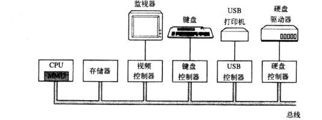
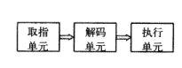
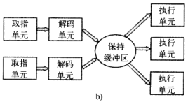
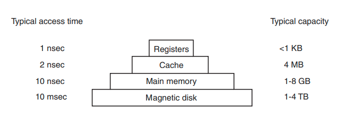

# Chapter 1 引论
## 计算机硬件介绍

### 处理器
CPU Control Process Unit，从内存中读取指令，解码以确定其类型和操作数，执行指令。
每个cpu都有一套可执行的专门指令集。
寄存器是用来解决访问内存时间远大于执行指令时间的问题。通用寄存器用来保存变量和临时结果；特殊寄存器用来保存状态，比如程序计数器，用来保存将要取出的下一条指令的内存地址；
堆栈指针，指向内存中当前堆栈的顶端，这个栈含有已经进入但未退出的每个过程的框架。一个框架中包含输入参数、局部变量和未保存在寄存器里的临时变量。
程序状态字寄存器，包含了条件码位，cpu优先级，模式（用户态、内核态），以及其他控制位。
流水线pipeline：一个cpu有分开的取指单元、解码单元和执行单元，在执行指令n时，可以解码n+1，取指令n+2，而不需要等待n完成后再去取指令n+1、解码n+1、执行n+1。缺点是一条指令进入流水线，就必须被执行完毕。

超标量CPU：增加了保持缓冲区。当执行单元空闲，就检查缓冲区是否有待执行的指令，如果有就从缓冲区中移出并执行。缺点是指令可能不按照顺序执行。

多数cpu都有两种模式，即用户态和内核态。内核态运行时，cpu可以执行指令集的任何指令，可以访问整个硬件、使用硬件的每种功能。用户态只允许执行整个指令集的一个子集和访问所有功能的一个子集。

trap 陷阱指令：一种特殊的指令，用于引发一个同步中断，使处理器从当前态切换到内核态，这一过程允许用户程序请求操作系统提供服务，比如文件操作、进程管理、内存分配等。
    工作原理：
    -触发陷阱
    -切换模式
    -执行服务
    -切换回模式
    用途：
    -系统调用
    -异常处理
    -中断处理
系统调用system call：trap指令。

多线程不提供真正的并行处理，微观角度来看，在一个时刻只有一个进程在运行，但线程的切换时间减少到纳秒级别，从宏观来看是并行的。

### 存储器 Memory
理想状态下，存储器的速度应该要快于cpu执行一条指令的速度，以免cpu受到存储器的限制；同时需要价格低、容量大，但目前的技术无法满足。

1.寄存器 register：和cpu用同种材料，所以速度和cpu一样快，没有延迟。
2.高速缓存 cache：主存被分割为高速缓存行cache line，每个line典型大小为64字节